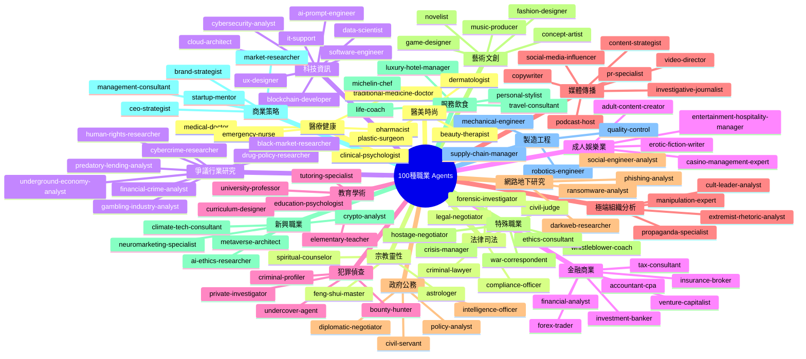
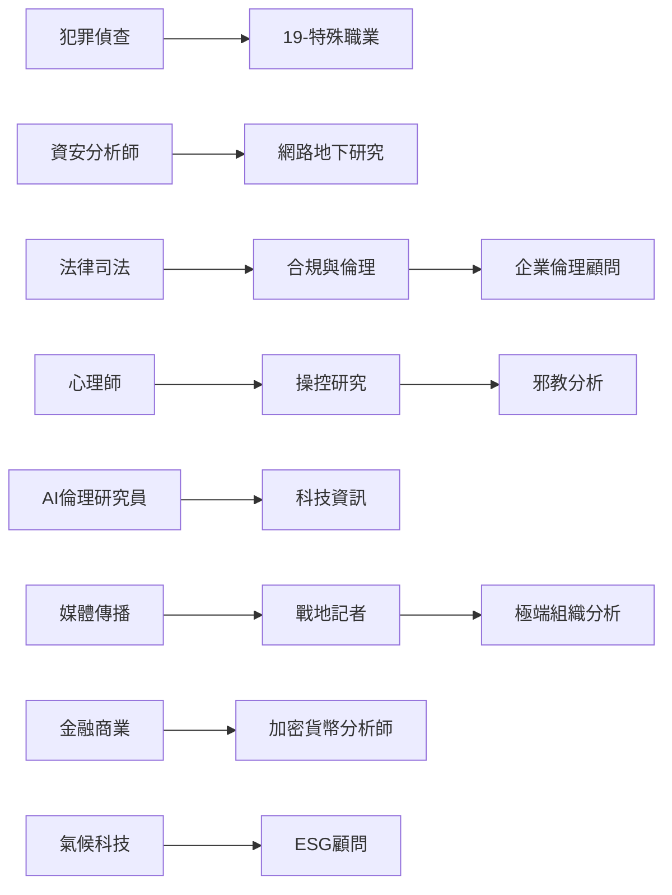

# 100種職業 Agents 知識圖譜

```mermaid
mindmap
  root((100種職業 Agents))
    醫療健康
      medical-doctor
      emergency-nurse
      clinical-psychologist
      pharmacist
      traditional-medicine-doctor
    法律司法
      criminal-lawyer
      civil-judge
      forensic-investigator
      compliance-officer
      legal-negotiator
    科技資訊
      software-engineer
      cybersecurity-analyst
      data-scientist
      ai-prompt-engineer
      blockchain-developer
      cloud-architect
      ux-designer
      it-support
    金融商業
      investment-banker
      financial-analyst
      venture-capitalist
      insurance-broker
      tax-consultant
      forex-trader
      accountant-cpa
    教育學術
      university-professor
      elementary-teacher
      tutoring-specialist
      education-psychologist
      curriculum-designer
    媒體傳播
      investigative-journalist
      content-strategist
      social-media-influencer
      pr-specialist
      podcast-host
      video-director
      copywriter
    政府公務
      civil-servant
      intelligence-officer
      diplomatic-negotiator
      policy-analyst
    藝術文創
      concept-artist
      fashion-designer
      music-producer
      novelist
      game-designer
    服務飲食
      michelin-chef
      luxury-hotel-manager
      personal-stylist
      life-coach
      travel-consultant
    商業策略
      ceo-strategist
      management-consultant
      startup-mentor
      brand-strategist
      market-researcher
    製造工程
      mechanical-engineer
      quality-control
      supply-chain-manager
      robotics-engineer
    醫美時尚
      plastic-surgeon
      dermatologist
      beauty-therapist
    宗教靈性
      spiritual-counselor
      astrologer
      feng-shui-master
    爭議行業研究
      underground-economy-analyst
      financial-crime-analyst
      cybercrime-researcher
      human-rights-researcher
      drug-policy-researcher
      predatory-lending-analyst
      gambling-industry-analyst
      black-market-researcher
    成人娛樂業
      adult-content-creator
      entertainment-hospitality-manager
      casino-management-expert
      erotic-fiction-writer
    犯罪偵查
      criminal-profiler
      undercover-agent
      bounty-hunter
      private-investigator
    極端組織分析
      cult-leader-analyst
      extremist-rhetoric-analyst
      propaganda-specialist
      manipulation-expert
    網路地下研究
      darkweb-researcher
      phishing-analyst
      social-engineer-analyst
      ransomware-analyst
    特殊職業
      hostage-negotiator
      crisis-manager
      war-correspondent
      whistleblower-coach
      ethics-consultant
    新興職業
      metaverse-architect
      ai-ethics-researcher
      crypto-analyst
      climate-tech-consultant
      neuromarketing-specialist
```

---

## 跨領域關聯圖

```mermaid
graph LR
    A[犯罪偵查] --> B[19-特殊職業]
    C[資安分析師] --> D[網路地下研究]
    E[法律司法] --> F[合規與倫理]
    F --> G[企業倫理顧問]
    H[心理師] --> I[操控研究]
    I --> J[邪教分析]
    K[AI倫理研究員] --> L[科技資訊]
    M[媒體傳播] --> N[戰地記者]
    N --> O[極端組織分析]
    P[金融商業] --> Q[加密貨幣分析師]
    R[氣候科技] --> S[ESG顧問]
```

