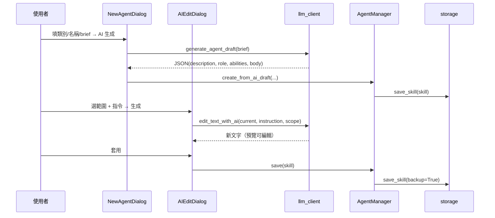

# Knowledge Graph — Agent Manager

## 模組關聯（v1.4 — 新增 tool_registry.py + installer.py + InstallerDialog）

```mermaid
graph TD
    GUI[main.py<br/>AgentManagerApp<br/>NewAgentDialog<br/>AIEditDialog<br/>ImportDialog<br/>InstallerDialog<br/>SettingsDialog] --> Orch[agent_manager.py<br/>AgentManager]
    GUI --> Evo[evolution_engine.py]
    GUI --> Store[storage.py]
    GUI --> Cfg[config.py]
    GUI --> LLM[llm_client.py]
    GUI --> Imp[importer.py]
    GUI --> Inst[installer.py]

    Orch --> Tpl[template_engine.py]
    Orch --> Val[validator.py]
    Orch --> Store
    Orch --> Cat[categories.py]

    Evo --> Store
    Evo --> Val
    Evo --> Cat
    Evo --> Rules[evolution_rules.py]
    Evo --> LLM
    Evo --> Cfg

    LLM --> Cfg
    Rules --> Cfg
    Rules --> Val

    Tpl --> Store
    Tpl --> Cat

    Store --> FS[(agents/ 檔案系統)]
    Evo --> LOG[(.evolution.log)]
    Store --> BAK[(.backup/)]
    Cfg --> CFGFILE[(.config.json)]
    LLM -.https.-> OR[OpenRouter]
    Imp --> Store
    Imp --> Cat[categories.py]
    Imp -.讀取.-> SRC[(agency-agents-main/)]
    Inst --> Reg[tool_registry.py]
    Inst --> Store
    Inst --> Cat
    Reg -.讀寫.-> Tools[(12 個 AI 工具目錄)]
```

## 類別 × Agent 數量
- v1.0.0：20 大類、100 個 Agent
- v1.1.0：**21 大類、106 個 Agent**（新增 `21-AI生成` × 6）
- v1.3.0：**37 大類、~300 個 Agent**（新增 `22-Academic` ~ `37-Testing` × 16 類，匯入自 agency-agents-main）

### 21-AI生成（v1.1 新增）
| slug | 用途 |
|------|------|
| image-prompt-engineer | 圖片生成提示詞（SD/MJ/Flux/DALL·E） |
| video-prompt-engineer | 影片生成提示詞（Sora/Runway/Kling/Pika） |
| audio-prompt-engineer | 音訊/音樂（Suno/Udio/Stable Audio/ElevenLabs） |
| 3d-prompt-engineer | 3D 模型（Meshy/Rodin/TripoSR） |
| llm-prompt-engineer | LLM 提示詞與結構化輸出 |
| agent-architect | 多 Agent 系統架構設計 |

## 關鍵資料結構

### AgentSkill
```python
@dataclass
class AgentSkill:
    path: Path           # agents/<cat>/<slug>/SKILL.md
    frontmatter: dict    # YAML 解析結果
    body: str            # frontmatter 後的 Markdown
```

### Issue
```python
@dataclass
class Issue:
    severity: Literal["CRITICAL", "HIGH", "MEDIUM", "LOW"]
    field: str
    message: str
    suggestion: str
```

### EvolutionRecord（寫入 .evolution.log；v1.1 擴充）
```python
@dataclass
class EvolutionRecord:
    timestamp: str
    skill_path: str
    action: str              # "skeleton" | "api" | "suggest" | "skip"
    mode_reason: str         # v1.1：規則決策原因
    model: str               # v1.1：若 action=api，使用的模型
    fixed_issues: list[dict]
    remaining_issues: list[dict]
    error: str = ""          # v1.1：API 失敗原因（若有）
```

### AppConfig（v1.1 新增；`.config.json`）
```python
@dataclass
class AppConfig:
    openrouter_api_key: str
    openrouter_base_url: str
    primary_model: str
    fallback_model: str
    request_timeout: int
    max_tokens: int
    temperature: float
    evolution_use_api: bool
    evolution_min_severity: str     # CRITICAL | HIGH | MEDIUM | LOW
    evolution_auto_apply: bool
    evolution_require_validation: bool
    evolution_max_agents_per_run: int
    evolution_dry_run: bool
    custom_models: list[str]
```

### RuleDecision（v1.1 新增）
```python
@dataclass
class RuleDecision:
    should_evolve: bool
    mode: str    # "skeleton" | "api" | "suggest" | "skip"
    reason: str
```

## 命名 / 路徑規則
- 類別資料夾：`NN-中文名`（兩位數字前綴，`01`~`99`）
- slug：CJK 相容的 slugify（保留中文、移除特殊字元）
- frontmatter `metadata.category` 必須 === 類別資料夾名

## AI 生成 / AI 編輯資料流（v1.2 新增）



## 變更歷史
| 版本 | 日期 | 內容 | 影響範圍 |
|------|------|------|----------|
| v1.4.1 | 2026-04-21 | copilot 拆分為兩個工具：copilot-vscode（*.md）與 copilot-cli（*.agent.md），共 13 工具 | tool_registry |
| v1.4.0 | 2026-04-21 | 新增 tool_registry.py + installer.py + InstallerDialog；12 工具安裝/備份（Windows 實驗） | main / installer / tool_registry |
| v1.3.0 | 2026-04-21 | 新增 importer.py + ImportDialog；匯入 agency-agents-main 16 類 ~200 個 Agent | main / importer / categories |
| v1.2.0 | 2026-04-18 | 新增 AIEditDialog、AI 生成/編輯資料流 | main / llm_client / agent_manager |
| v1.1.0 | 2026-04-18 | 加入 21-AI生成、AppConfig、RuleDecision、EvolutionRecord v1.1 | 全模組 |
| v1.0.0 | 2026-04-18 | 初始模組關聯圖 | — |
